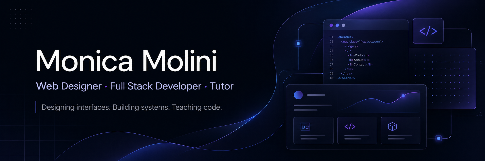

  

I design and build digital experiences that combine visual identity, usability and clean code.

My work sits between design and development: I create interfaces, websites and web applications with attention to layout, responsiveness, accessibility, component structure and maintainability.

---

## About me

I’m a web designer and full stack developer based in Italy.

I work on modern websites, landing pages, portfolio experiences, WordPress projects and full stack applications.  
My background allows me to move from visual design and UX decisions to frontend development, backend integration and database structure.

I also teach web development, helping students understand not only how to write code, but how to think through a project from structure to implementation.

---

## What I do

- Web design and UI design
- Responsive websites
- Landing pages
- Portfolio websites
- WordPress and Elementor websites
- React applications
- Full stack projects
- Authentication systems
- Dashboards and protected areas
- Educational exercises and coding projects

---

## Tech stack

### Frontend

### Backend

### Design & CMS

---

## Featured projects

### TouristMe

A travel-oriented community platform concept designed to let users discover, review and organize points of interest, with thematic itineraries supported by AI.

**Focus:** community, travel experience, itinerary generation, UX structure  
**Stack:** React, Node.js, Express, PostgreSQL, JWT

---

### Personal Portfolio

My portfolio website, designed and developed as a visual and technical showcase of my work.

**Focus:** visual identity, responsive design, project presentation, interaction design  
**Stack:** React, Vite, Tailwind CSS

---

### Full Stack Auth System

A complete authentication flow with registration, login, protected dashboard, editable user data and JWT-based authorization.

**Focus:** authentication, protected routes, frontend/backend integration  
**Stack:** React, Express, PostgreSQL, JWT, React Router

---

## My approach

I care about building projects that are clear, usable and maintainable.

For me, a good digital product needs:

- a strong visual direction;
- a clear information architecture;
- responsive layouts that work across devices;
- reusable components;
- readable code;
- practical UX decisions;
- consistency between design and implementation.

---

## Teaching

Alongside client and personal projects, I work as a tutor and teacher in web development.

I create lessons, exercises and practical projects on:

- HTML and CSS
- JavaScript
- React
- Node.js and Express
- SQL and databases
- Git and GitHub
- full stack project structure

---

## Contact

Portfolio: coming soon  
LinkedIn: add your LinkedIn URL  
Email: add your email  
